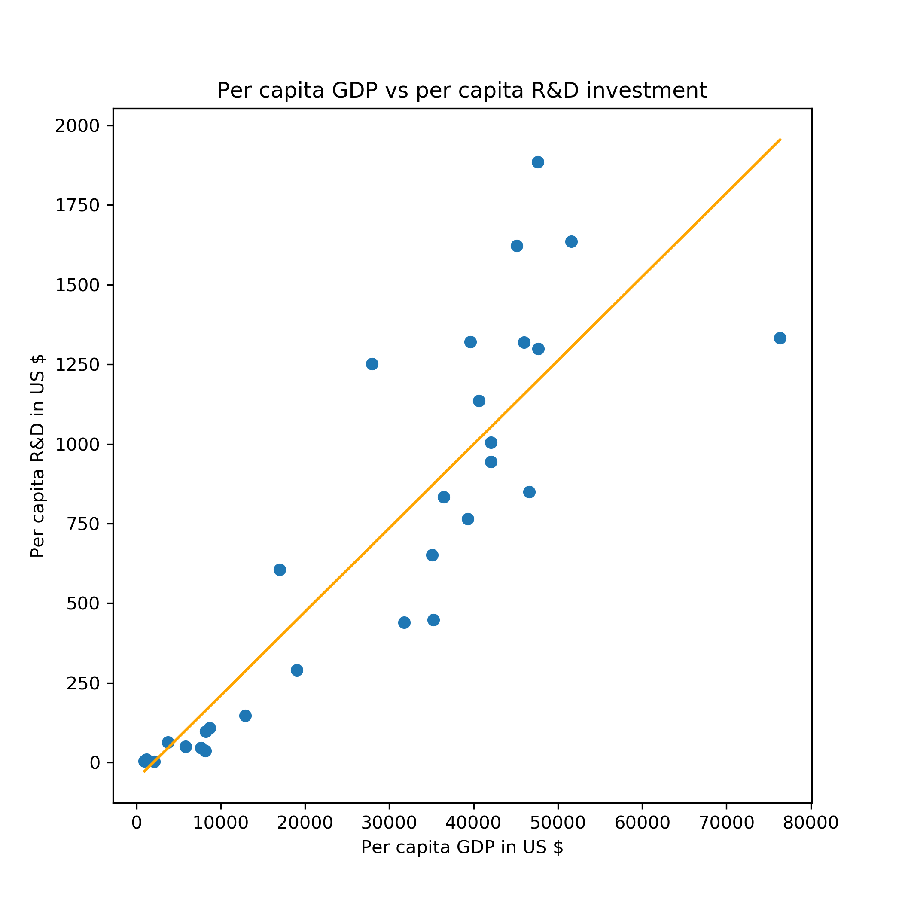
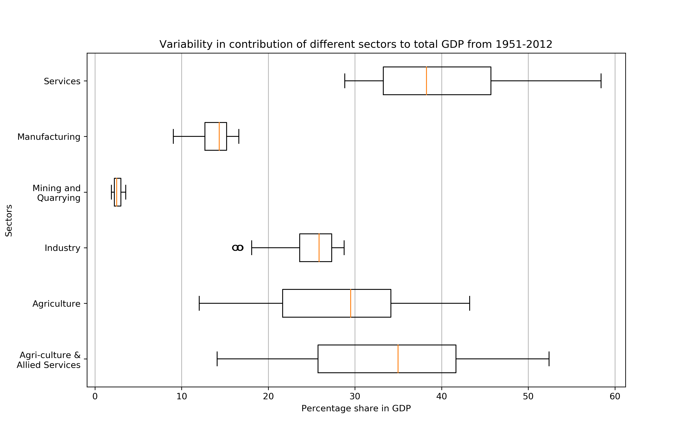
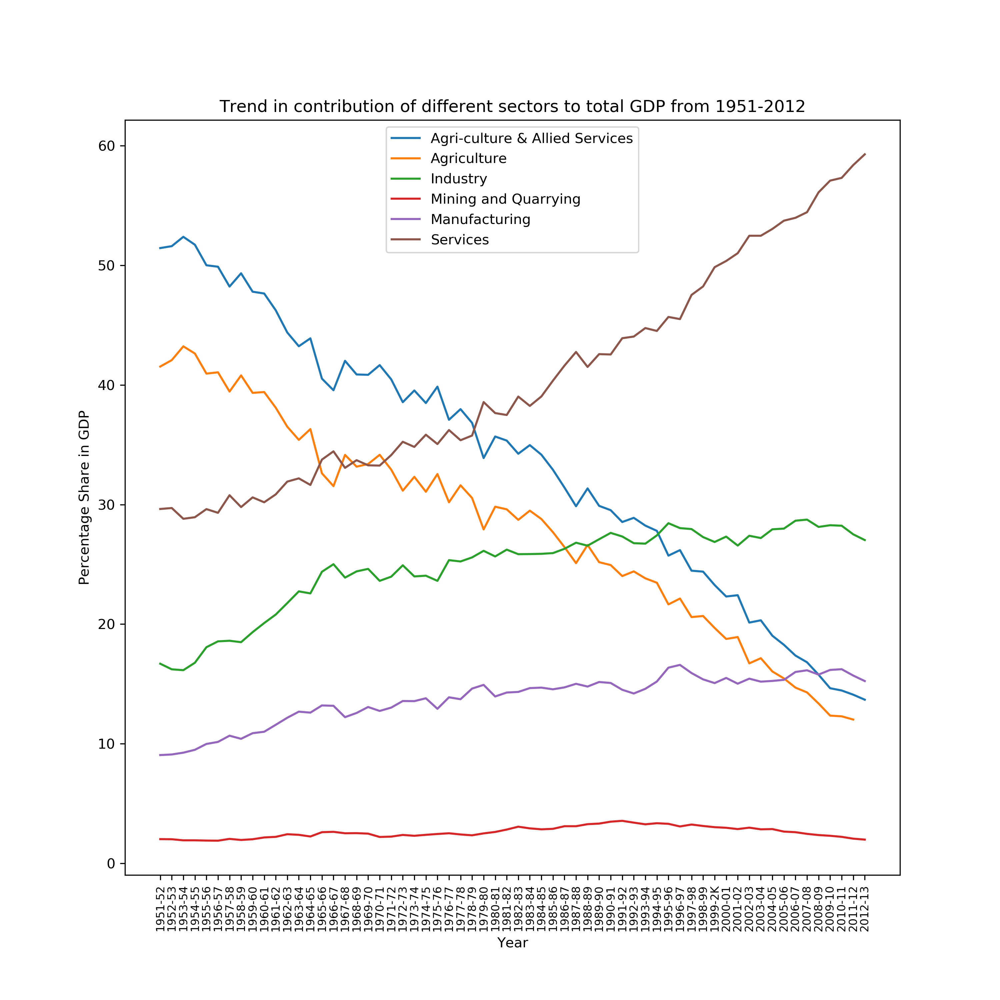

# DS200
Assignment for the course DS200

## How to run
1. Set up a python 3 conda environment and install the packages from requirements.txt
2. Download the data and zipfile
3. Run ds200.py to obtain the plots

## Dataset
The datasets used for plotting the figures are present in the `data` directory. The data is also available publicly at <https://data.gov.in>

## R&D Expenditure Per Capita and as Percentage of GDP for Selected Countries 2009 (in US$)

**a. Scatter Plot**

**Observation:** The scatter plot above shows the correlation between per capita GDP and investment in R&D for different countries. We observe that countries with higher GDP have higher investments into R&D.

## GDP and Major Industrial Sectors of Economy

**b. Box Plot**

**Observation:** From the plot we observe that the min, max and median values of the service sector is higher than those of any other sector. This shows that service sector on an average has higher contribution to the total GDP. The sectors associated to agriculture also have a substantial contribution towards the GDP but they also have much larger variability. The mining and manufacturing industries consistently have a smaller contribution to the GDP.

**c. Line Plot**

**Observation:** The above line plot shows the trend in contribution of different sectors to the total GDP. This trend is not visible in box plot. From the above plot we see that over the years the contribution of agriculture sectors to GDP has declined while that of service sector has increased. The contribution of mining and quarring has almost remained constant over the years whereas the manufacturing and industrial sectors contibution has grown at a very low rate.

## Citations

1. R&D Expenditure Per Capita and as Percentage of GDP for Selected Countries 2009 (in US$)  
Source : UIS, UNESCO (Website accessed on 11 August, 2013); World Development Indicators, The World Bank; * OECD Main S&T Indicators vol. 2011/2; Note: 1. # 2008; 2. % Estimate based on 2009-10 exchange rate, Economic Survey 2010-11.

2. GDP of India and major Sectors of Economy, Share of each sector to GDP and Growth rate of GDP and other sectors of economy 1951-52 onward  
Source : CSO

